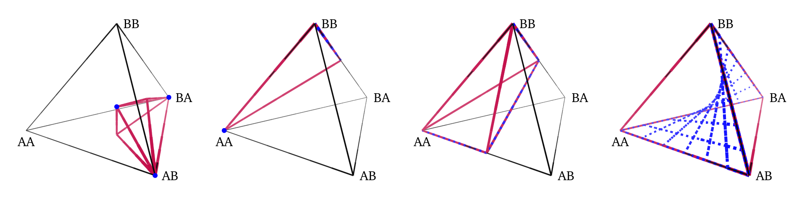
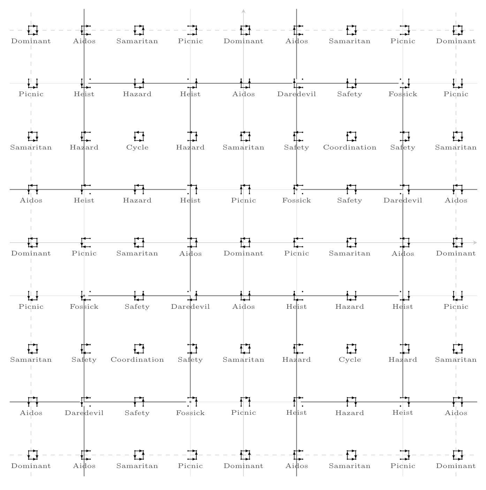
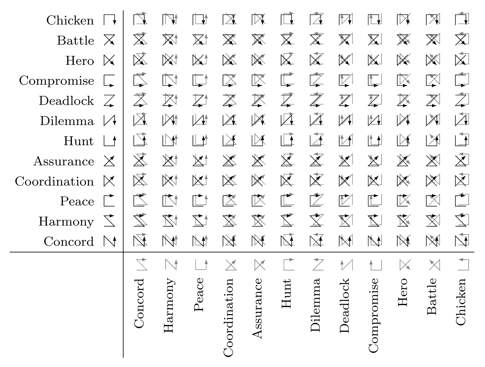

# twoxtwogame

A LaTeX package for visualizing 2x2 normal-form games. The package builds upon
PGF/TikZ to produce beautiful vector graphic visualizations indented for use in
scientific publications. Commands include producing graphical representations
of 2x2 games, plotting the equilibria in 2x2 games, and game embeddings for 2x2
games.

## Example Functionality

### Equilibria



### Equilibrium-invariant game embeddings



###  Ordinal graphs




## Installation

Simply include the `twoxtwogame.sty` file in your working directory.

## Usage

Include in the preamble the `twoxtwogame` package.

```tex
\usepackage{twoxtwogame}
```

In the main document, utilize the commands that the package provides.

```tex
\cyclebrgraph~Matching Pennies has a single mixed Nash equilibrium, while
\coordinationbrgraph~two pure Nash equilibria and a single mixed Nash
equilibrium.
```

For further information, please refer to the included package documentation:
`twoxtwogame_doc.pdf` which can be built from `twoxtwogame_doc.tex`.

## Citing this work

Please cite the following announcement paper when using this package.

```tex
@misc{marris2024_twoxtwogame,
    TODO(b/319068130): Add when paper is released.
}
```

## License and disclaimer

Copyright 2024 DeepMind Technologies Limited

All software is licensed under the Apache License, Version 2.0 (Apache 2.0);
you may not use this file except in compliance with the Apache 2.0 license.
You may obtain a copy of the Apache 2.0 license at:
https://www.apache.org/licenses/LICENSE-2.0

All other materials are licensed under the Creative Commons Attribution 4.0
International License (CC-BY). You may obtain a copy of the CC-BY license at:
https://creativecommons.org/licenses/by/4.0/legalcode

Unless required by applicable law or agreed to in writing, all software and
materials distributed here under the Apache 2.0 or CC-BY licenses are
distributed on an "AS IS" BASIS, WITHOUT WARRANTIES OR CONDITIONS OF ANY KIND,
either express or implied. See the licenses for the specific language governing
permissions and limitations under those licenses.

This is not an official Google product.
